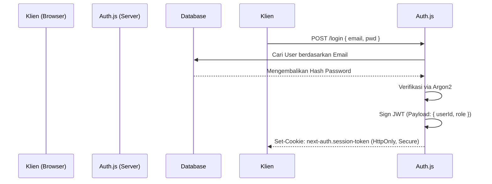

# 55. AUTHENTICATION FLOW
**HomeLink 2.0 Enterprise Documentation**

## 1. Title
HomeLink 2.0 Secure Authentication Flow

## 2. Purpose
To map the exact sequence of how a user proves their identity to the system and maintains that session securely over time.

## 3. Scope
Covers JWT, HttpOnly Cookies, and NextAuth/Auth.js integration.

## 4. Audience
- **Security & Backend Engineers:** For implementing secure login.

## 5. Dependencies
- Fulfills the security constraints in `48_DATABASE_SECURITY.md`.

## 6. Definitions
- **HttpOnly Cookie:** A cookie that cannot be accessed via client-side JavaScript (XSS protection).
- **JWT:** JSON Web Token.

## 7. Architecture
Session management via Auth.js v5 (NextAuth).

## 8. Requirements

### 8.1. The "Stateless JWT" Strategy
- Sistem menggunakan JWT yang ditandatangani secara kriptografis (*signed*) tanpa menyimpan tabel sesi di database (Stateless). 
- Hal ini secara drastis mengurangi beban baca pada PostgreSQL setiap kali *route* dilindungi diakses.

### 8.2. Login Flow (Email/Password)

### 8.3. Security Mandates
- **XSS Protection:** Token Sesi TIDAK BOLEH dikirim dalam *response body* JSON untuk disimpan Klien di `localStorage`. Token HARUS dikirim eksklusif melalui *header* `Set-Cookie` dengan flag `HttpOnly=true` dan `Secure=true`.
- **CSRF Protection:** Setiap permintaan modifikasi data (`POST/PUT/DELETE`) dari *browser* harus diverifikasi token CSRF bawaan NextAuth.

## 9. Implementation
- Engineers must rely on the stable implementations provided by `Auth.js` rather than writing bespoke cryptography functions.

## 10. Acceptance Criteria
- [x] Clear prohibition of storing sensitive tokens in `localStorage`.
- [x] Sequence diagram illustrates the correct modern web auth flow.

## 11. Future Improvements
- Implement Refresh Token rotation in Phase 3 if session lifetimes need to be extended safely.

## 12. References
- *Auth.js (NextAuth) Documentation*

## 13. Version History
| Version | Date       | Author               | Status   | Notes                 |
| :---    | :---       | :---                 | :---     | :---                  |
| 1.0.0   | 2026-07-24 | Documentation Arch AI| APPROVED | Initial SSOT creation |
