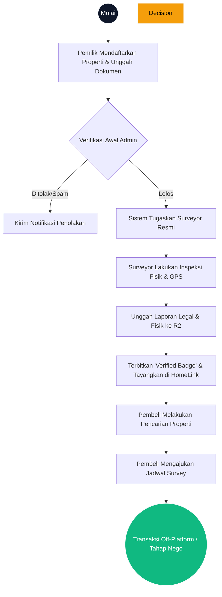

# 07. BUSINESS PROCESS DOCUMENT
**HomeLink 2.0 Enterprise Documentation**

## 1. Title
HomeLink 2.0 Core Business Process Document

## 2. Purpose
To map and document the end-to-end operational workflows of HomeLink 2.0. This ensures all departments (Tech, Ops, Customer Service) understand how data and physical interactions move through the system.

## 3. Scope
Covers the primary macro-process: Property Listing Submission $\rightarrow$ Verification $\rightarrow$ Publication $\rightarrow$ Survey Booking.

## 4. Audience
- **Operations Team:** To standardize internal SOPs for manual interventions.
- **Software Engineers:** To correctly model the state machine of a Property Listing (e.g., `PENDING` $\rightarrow$ `VERIFIED`).

## 5. Dependencies
- Dependent on `04_FUNCTIONAL_REQUIREMENT_SPECIFICATION_FRS.md`.

## 6. Definitions
- **Admin Review:** Initial basic screening to reject obvious spam before assigning a human surveyor.
- **GPS Validation:** Metadata extracted from images uploaded by surveyors to ensure they are physically at the property.

## 7. Architecture
The process relies heavily on PostgreSQL for state management and Event Queues for triggering surveyor assignments.

## 8. Requirements
### 8.1. Macro Business Process Diagram

### 8.2. Sub-Process Breakdown
**A. Property Registration (Owner Phase)**
1. Owner creates an account and completes phone OTP.
2. Owner fills in property details (address, price, specs).
3. Owner uploads proof of ownership (e.g., PBB, SHM). System sets status to `PENDING`.

**B. Verification (Ops & Surveyor Phase)**
1. System triggers webhook to internal dashboard.
2. Operations admin does a quick sanity check (5 mins).
3. System assigns the nearest available surveyor based on ZIP code mapping.
4. Surveyor visits the site, takes GPS-tagged photos, verifies the physical certificate, and uploads the PDF report.
5. System sets status to `FULLY_VERIFIED`.

**C. Discovery & Booking (Buyer Phase)**
1. Verified property becomes visible on the Homepage.
2. Buyer searches and finds the property.
3. Buyer selects an available time slot and requests a visit.
4. Owner and Agent receive an automated WhatsApp notification to confirm.

## 9. Implementation
- The engineering team must implement an Audit Trail table in PostgreSQL to log every status change of a property with a timestamp and the `userId` who performed the change.

## 10. Acceptance Criteria
- [x] Process diagram strictly follows standard flowchart notations.
- [x] Clear demarcation between human actions and system automated actions.
- [x] All possible states of a listing are accounted for.

## 11. Future Improvements
- Fully automate the "Verifikasi Awal Admin" using an AI OCR (Optical Character Recognition) model to validate ID cards and certificates instantly.

## 12. References
- N/A

## 13. Version History
| Version | Date       | Author               | Status   | Notes                 |
| :---    | :---       | :---                 | :---     | :---                  |
| 1.0.0   | 2026-07-24 | Documentation Arch AI| APPROVED | Initial SSOT creation |
