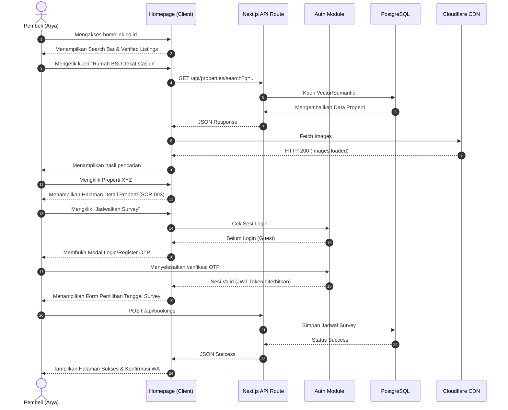

# 09. USER JOURNEY
**HomeLink 2.0 Enterprise Documentation**

## 1. Title
HomeLink 2.0 Digital User Journey (Happy Path)

## 2. Purpose
To map out the exact sequence of digital interactions a user takes to achieve their primary goal within the HomeLink 2.0 application. This ensures a frictionless UX and logical screen flows.

## 3. Scope
Covers the core "Property Discovery to Survey Booking" flow for the Buyer persona.

## 4. Audience
- **UX Designers:** To design screen-by-screen wireframes.
- **Frontend Engineers:** To implement client-side routing and state management.

## 5. Dependencies
- Dependent on `08_USER_PERSONA.md`.

## 6. Definitions
- **Happy Path:** The default scenario featuring no exceptional or error conditions.

## 7. Architecture
Frontend routing is managed by Next.js 16 App Router.

## 8. Requirements

### 8.1. Buyer Journey Sequence Diagram

### 8.2. Key Interaction Nodes
1. **The Search Bar Entry:** Must be prominently placed Above-the-Fold. Loading states must use skeleton loaders, never a blank screen.
2. **Authentication Interruption:** The login modal must not navigate the user away from the property detail page to preserve context.
3. **Success State:** Must clearly indicate the next offline step (e.g., "Agen kami akan menghubungi Anda via WhatsApp dalam 5 menit").

## 9. Implementation
- The frontend team must use Next.js `Intercepting Routes` or `Parallel Routes` for the Authentication Modal to prevent hard navigations.

## 10. Acceptance Criteria
- [x] Journey diagram includes all technical touchpoints (Client, API, DB, CDN).
- [x] Edge cases like "Not Logged In" are handled gracefully in the flow.

## 11. Future Improvements
- Add secondary journey maps for "Mortgage Application (KPR)" flows.

## 12. References
- `08_USER_PERSONA.md`

## 13. Version History
| Version | Date       | Author               | Status   | Notes                 |
| :---    | :---       | :---                 | :---     | :---                  |
| 1.0.0   | 2026-07-24 | Documentation Arch AI| APPROVED | Initial SSOT creation |
