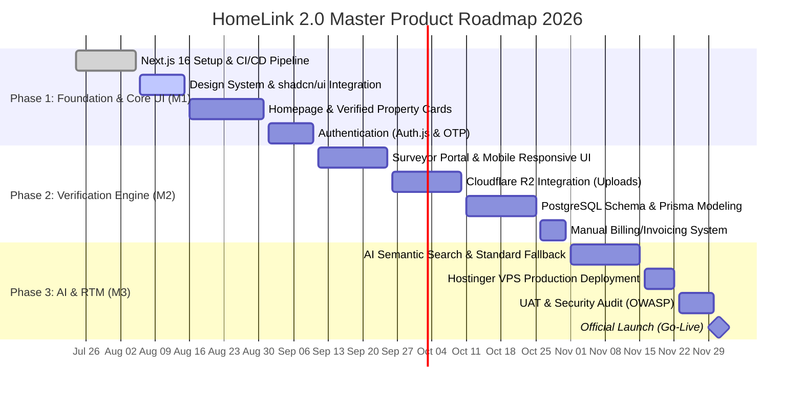

# 13. PRODUCT ROADMAP
**HomeLink 2.0 Enterprise Documentation**

## 1. Title
HomeLink 2.0 Strategic Product Roadmap (2026)

## 2. Purpose
To provide a high-level visual and structural timeline of product deliverables, ensuring that engineering and business teams are aligned on Phase 1 priorities versus future enhancements.

## 3. Scope
Covers the product development lifecycle from Foundation (Phase 1) to AI & Deployment (Phase 3).

## 4. Audience
- **Project Managers:** For agile sprint planning and resource allocation.
- **Engineering Teams:** To anticipate architectural requirements for upcoming features.
- **Marketing Teams:** To align campaign launches with feature releases.

## 5. Dependencies
- Dependent on the features outlined in `03_PRODUCT_REQUIREMENT_DOCUMENT_PRD.md`.

## 6. Definitions
- **MVP:** Minimum Viable Product. For HomeLink 2.0, the "MVP" is heavily polished (Minimum Lovable Product).
- **RTM:** Release to Market.

## 7. Architecture
N/A

## 8. Requirements

### 8.1. Roadmap Visualization (Gantt Chart)

### 8.2. Phase Definitions
**Phase 1: Foundation & Core UI (Months 1-2)**
Fokus pada pengaturan infrastruktur awal (Next.js 16), pembuatan sistem desain berstandar Apple, UI Homepage, dan sistem registrasi/login yang aman.

**Phase 2: Verification Engine & Storage (Month 3)**
Fokus pada *back-office* dan operasional inti. Membangun portal untuk Surveyor, integrasi penyimpanan CDN Cloudflare R2 untuk aset berat, optimasi arsitektur database relasional (PostgreSQL), dan sistem penagihan manual (Invoicing) untuk mengakomodasi arus kas awal sebelum otomatisasi Payment Gateway.

**Phase 3: AI Capabilities & Go-Live (Month 4)**
Fokus pada fitur pembeda utama (*AI Semantic Search*) beserta fallback pencarian standar, uji coba keamanan tingkat enterprise, finalisasi *deployment* di Hostinger VPS menggunakan PM2/Docker, dan peluncuran resmi.

### 8.3. Module-to-Phase Mapping (`docs/pages/` Scope Definition)

**Konteks (v1.0.1):** Folder `docs/pages/` berisi 18 modul spesifikasi halaman (161 file), namun sebelum revisi ini tidak ada dokumen yang secara eksplisit memetakan modul mana yang benar-benar termasuk Fase 1 (MVP) versus fase mendatang. Tabel ini menutup celah tersebut dan menjadi rujukan wajib sebelum menulis spesifikasi detail per halaman (lihat juga role Fase 2+ baru di `03_PRODUCT_REQUIREMENT_DOCUMENT_PRD.md` §8.1).

| Modul `pages/` | Fase | Justifikasi |
| :--- | :--- | :--- |
| `01_public_website` | **Fase 1** | Homepage, search, halaman publik inti — sesuai SCR-001/002 di `18_SCREEN_INVENTORY.md`. |
| `02_authentication` | **Fase 1** | Login/Register/OTP — FR-AUTH di `04_FRS.md`. |
| `03_property_search` | **Fase 1** | Fitur pembeda utama Fase 1 (AI Semantic Search) — `03_PRD.md` Feature 1. |
| `04_property_detail` | **Fase 1** | Termasuk badge verifikasi & booking — `03_PRD.md` Feature 2 & 3. |
| `05_buyer_dashboard` | **Fase 1** | Role Buyer aktif sejak MVP. |
| `06_owner_dashboard` | **Fase 1** | Role Owner aktif sejak MVP. **Kecuali** `10_BILLING.md` di dalam modul ini — lihat baris `15_billing` di bawah. |
| `09_surveyor` | **Fase 1** | Sejalan dengan Gantt "Phase 2: Surveyor Portal" pada §8.1 — dipertahankan sebagai Fase 1 akhir/Fase 2 awal karena verifikasi fisik adalah prasyarat listing tayang (lihat `07_BUSINESS_PROCESS_DOCUMENT.md`). |
| `11_admin` | **Fase 1** | Role Admin (moderasi & verifikasi) wajib aktif sejak Go-Live. **Kecuali** `08_PAYMENT.md` dan `09_SUBSCRIPTION.md` — lihat `15_billing`. |
| `17_company`, `18_legal` | **Fase 1** | Halaman legal/company wajib ada sebelum Go-Live publik. **Keputusan de-duplikasi v1.0.2 (resolved):** `01_public_website` tetap kanonik untuk halaman pemasaran level-root (`02_ABOUT_US`, `03_CONTACT`, `04_CAREERS`) karena SEO/discoverability lebih baik di path root (`/about-us`, `/contact`, `/careers`); `18_legal` menjadi kanonik untuk seluruh dokumen kepatuhan hukum (`01_PRIVACY_POLICY`, `02_TERMS`, `03_COOKIE_POLICY`, plus `04_REFUND_POLICY`, `05_DISCLAIMER`, `06_LICENSING` yang baru), dikelompokkan di `/legal/*` mengikuti pola footer "Legal" umum. Konsekuensi: `01_public_website/13_TERMS.md`, `14_PRIVACY_POLICY.md`, `15_COOKIE_POLICY.md` dan `17_company/01_ABOUT.md`, `03_CAREERS.md`, `04_CONTACT.md` menjadi **halaman redirect tipis** (Next.js `redirect()`) ke versi kanonik, bukan spesifikasi duplikat penuh. **Catatan v1.0.3:** Audit lanjutan menemukan bahwa 2 dari 3 sisa file `17_company` TERNYATA juga duplikat dan telah diperbaiki: `05_PARTNERSHIP.md` (duplikat `01_public_website/11_PARTNERS.md`) dan `06_PRESS_KIT.md` (duplikat `01_public_website/10_PRESS.md`) — keduanya kini menjadi redirect stub mengikuti pola yang sama. Hanya `02_TEAM.md` yang genuinely konten baru dan mendapat spesifikasi penuh. |
| `14_notification_center` | **Fase 2** | Riwayat notifikasi adalah kebutuhan operasional pasca-launch, bukan blocker MVP. |
| `07_partner_agent_dashboard` | **Fase 2** | Terikat pada monetisasi Tier 3 SaaS for Agents (`02_BRD.md` §8.3), role "Partner Agent" baru (`03_PRD.md` §8.1). |
| `08_internal_homelink_agent` | **Fase 2** | Role "Internal HomeLink Agent" baru — staf internal terpisah dari Admin moderasi. |
| `10_photographer` | **Fase 2** | Role "Photographer" baru; endpoint sudah ada di `52_ENDPOINT_CATALOGUE.md` §8.6. |
| `13_cms` | **Fase 2** | Sejalan dengan `89_CMS_MANUAL.md` yang sudah mengasumsikan modul CMS ini ada. |
| `12_super_admin` | **Fase 3** | Tenant Management/Feature Flags adalah kapabilitas multi-tenant yang belum dibutuhkan pada skala Fase 1-2. |
| `16_ai` (kecuali AI Search) | **Fase 4** | Hanya AI Semantic Search yang punya arsitektur (`39_AI_ARCHITECTURE.md`). AI Recommendation/Valuation/Assistant/Analytics menunggu dokumen arsitektur baru sebelum masuk roadmap aktif. |
| `15_billing` (+ `06_owner_dashboard/10_BILLING.md`, `11_admin/08_PAYMENT.md`, `11_admin/09_SUBSCRIPTION.md`) | **Fase 2 & 4** | Penagihan dasar (Manual Invoicing untuk *Verification Fee*) dimajukan ke **Fase 2** untuk mengamankan arus kas. Otomatisasi penuh dengan Payment Gateway tetap di **Fase 4**. |

**Aturan wajib:** Tim penulisan konten (Tahap 2 rencana audit) hanya boleh mengisi detail spesifikasi untuk modul berlabel **Fase 1** terlebih dahulu. Modul Fase 2-4 tetap berupa kerangka placeholder sampai fase sebelumnya selesai, supaya tidak menghabiskan waktu menspesifikasi fitur yang scope-nya bisa berubah.

## 9. Implementation
- Project Managers must break down these phases into actionable 2-week Jira/Linear sprints.
- Any features not listed in this roadmap are strictly considered "Phase 4 (Post-Launch)" to prevent scope creep.
- Module-to-phase mapping in §8.3 is binding for all `docs/pages/` content work.

## 10. Acceptance Criteria
- [x] The roadmap clearly defines a sequential dependency of phases.
- [x] A concrete target launch date (Go-Live) is established.

## 11. Future Improvements
- Develop Phase 4 Roadmap (Q1 2027) covering Agent SaaS Portal and Bank KPR Integrations after successful Phase 3 launch.

## 12. References
- `03_PRODUCT_REQUIREMENT_DOCUMENT_PRD.md`

## 13. Version History
| Version | Date       | Author               | Status   | Notes                 |
| :---    | :---       | :---                 | :---     | :---                  |
| 1.0.0   | 2026-07-24 | Documentation Arch AI| APPROVED | Initial SSOT creation |
| 1.0.1   | 2026-07-24 | Documentation Audit  | APPROVED | Menambahkan §8.3 Module-to-Phase Mapping untuk menutup celah scope antara dokumen bisnis dan folder `pages/` (161 file). |
| 1.0.2   | 2026-07-24 | Documentation Audit  | APPROVED | Meresolusi keputusan de-duplikasi `17_company`/`18_legal` vs `01_public_website` (lihat baris §8.3) — tidak lagi berstatus "diblokir". |
| 1.0.3   | 2026-07-24 | Documentation Audit  | APPROVED | Ditemukan 2 duplikasi tambahan yang terlewat di v1.0.2 (`17_company/05_PARTNERSHIP.md` dan `06_PRESS_KIT.md`) — diperbaiki dengan pola redirect yang sama. |
| 1.1.0   | 2026-07-25 | CEO AI               | APPROVED | Menggeser penagihan manual ke Fase 2 untuk memitigasi risiko arus kas, dan penambahan arsitektur pencarian fallback di Fase 3. |
