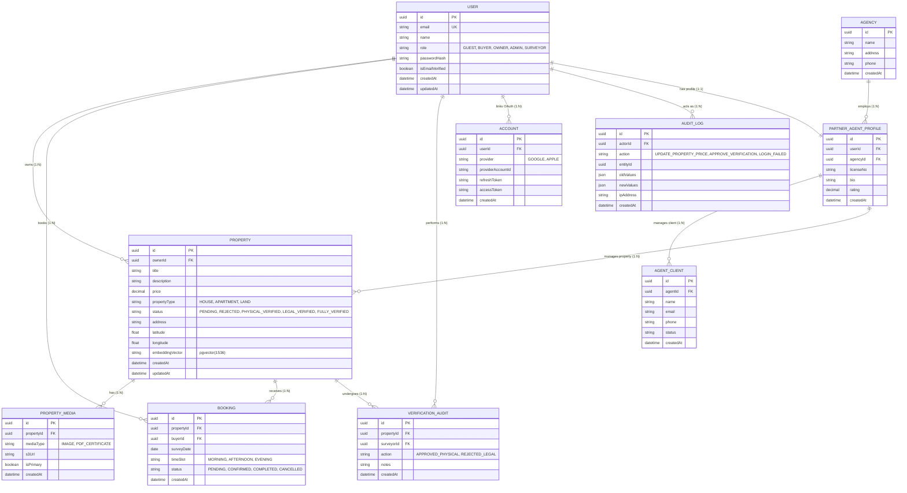

# 40. ENTITY RELATIONSHIP DIAGRAM (ERD)
**HomeLink 2.0 Enterprise Documentation**

## 1. Title
HomeLink 2.0 Core Entity Relationship Diagram (ERD)

## 2. Purpose
To provide a visual and structural blueprint of the PostgreSQL database schema. This helps engineers understand how data entities interact and relate to each other.

## 3. Scope
Covers Phase 1 tables: Users, Properties, Bookings, and Verification Audits.

## 4. Audience
- **Database / Backend Engineers:** For writing Prisma schema files.
- **Data Analysts:** For crafting SQL joins.

## 5. Dependencies
- Directly dictates the Prisma modeling defined in `37_DATABASE_ARCHITECTURE.md`.

## 6. Definitions
- **PK:** Primary Key (UUID).
- **FK:** Foreign Key.
- **One-to-Many (1:N):** A relationship where one record in Table A relates to multiple records in Table B.

## 7. Architecture
PostgreSQL Relational DB.

## 8. Requirements

### 8.1. Mermaid ERD Visualization

**Catatan v1.0.2:** Penambahan `AGENCY`, `PARTNER_AGENT_PROFILE`, dan `AGENT_CLIENT` untuk melengkapi Ekstensi ERD Fase 4 (Agent Management).

## 9. Implementation
- Backend engineers must map this ERD strictly into `schema.prisma`.
- All `id` fields MUST be `UUIDv4`, not auto-incrementing integers, to prevent enumeration attacks.

## 10. Acceptance Criteria
- [x] All primary entities for Phase 1 are mapped.
- [x] Cardinality (1:N, 1:1) is clearly visualized.
- [x] Phase 4 Agent models are integrated.

## 11. Future Improvements
- Expand ERD for Finance/Billing deeply.

## 12. References
- *Mermaid ER Diagram Syntax*

## 13. Version History
| Version | Date       | Author               | Status   | Notes                 |
| :---    | :---       | :---                 | :---     | :---                  |
| 1.0.0   | 2026-07-24 | Documentation Arch AI| APPROVED | Initial SSOT creation |
| 1.0.1   | 2026-07-24 | Documentation Audit  | APPROVED | Status/TimeSlot updates. |
| 1.0.2   | 2026-07-28 | Data AI              | APPROVED | Phase 4 Agent extensions. |
