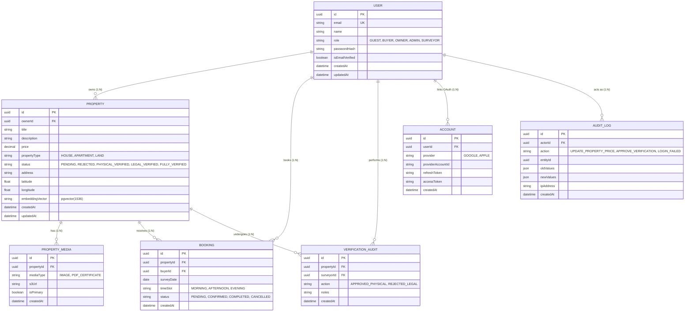

# 40. ENTITY RELATIONSHIP DIAGRAM (ERD)
**HomeLink 2.0 Enterprise Documentation**

## 1. Title
HomeLink 2.0 Core Entity Relationship Diagram (ERD)

## 2. Purpose
To provide a visual and structural blueprint of the PostgreSQL database schema. This helps engineers understand how data entities interact and relate to each other.

## 3. Scope
Covers Phase 1 tables: Users, Properties, Bookings, and Verification Audits.

## 4. Audience
- **Database / Backend Engineers:** For writing Prisma schema files.
- **Data Analysts:** For crafting SQL joins.

## 5. Dependencies
- Directly dictates the Prisma modeling defined in `37_DATABASE_ARCHITECTURE.md`.

## 6. Definitions
- **PK:** Primary Key (UUID).
- **FK:** Foreign Key.
- **One-to-Many (1:N):** A relationship where one record in Table A relates to multiple records in Table B.

## 7. Architecture
PostgreSQL Relational DB.

## 8. Requirements

### 8.1. Mermaid ERD Visualization

**Catatan v1.0.1 (Audit):** Entitas `ACCOUNT` dan `AUDIT_LOG` ditambahkan untuk menutup celah dokumentasi — keduanya sudah dirujuk sebagai kewajiban di dokumen lain (`31_MODULE_BREAKDOWN.md` §8.1 untuk `Account`; `67_AUDIT_LOGGING.md` §Struktur Log untuk `AuditLog`) namun sebelumnya tidak pernah dimodelkan di ERD. `AUDIT_LOG` bersifat *append-only/immutable* — tidak ada relasi `onDelete: Cascade` dari `USER` ke `AUDIT_LOG` (lihat `43_RELATIONSHIP_SPECIFICATION.md` untuk aturan RESTRICT). Entitas pendukung modul Fase 2-4 (CMS, Billing, Notification, Commission — lihat `13_PRODUCT_ROADMAP.md` §8.3) sengaja **belum** dimodelkan di sini; akan ditambahkan saat modul tersebut memasuki fase aktif, agar ERD Fase 1 tetap ramping dan tidak berspekulasi pada skema yang scope-nya bisa berubah.

## 9. Implementation
- Backend engineers must map this ERD strictly into `schema.prisma`.
- All `id` fields MUST be `UUIDv4`, not auto-incrementing integers, to prevent enumeration attacks.

## 10. Acceptance Criteria
- [x] All primary entities for Phase 1 are mapped.
- [x] Cardinality (1:N, 1:1) is clearly visualized.

## 11. Future Improvements
- Expand ERD for Agent/Broker Management tables in Phase 4.

## 12. References
- *Mermaid ER Diagram Syntax*

## 13. Version History
| Version | Date       | Author               | Status   | Notes                 |
| :---    | :---       | :---                 | :---     | :---                  |
| 1.0.0   | 2026-07-24 | Documentation Arch AI| APPROVED | Initial SSOT creation |
| 1.0.1   | 2026-07-24 | Documentation Audit  | APPROVED | `PROPERTY.verificationStatus` diganti nama menjadi `status` agar konsisten dengan `42_TABLE_SPECIFICATION.md` dan `29_LOW_LEVEL_DESIGN_LLD.md`. `BOOKING.timeSlot` diperluas menjadi `MORNING, AFTERNOON, EVENING` agar konsisten dengan `29_LOW_LEVEL_DESIGN_LLD.md`. Menambahkan entitas `ACCOUNT` dan `AUDIT_LOG` yang sebelumnya dirujuk di dokumen lain tapi tidak pernah dimodelkan. |
