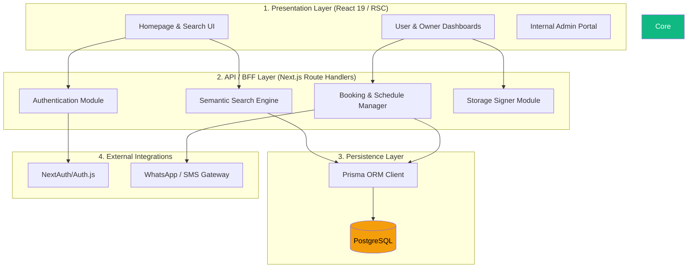

# 28. HIGH LEVEL DESIGN (HLD)
**HomeLink 2.0 Enterprise Documentation**

## 1. Title
HomeLink 2.0 High Level Design (HLD)

## 2. Purpose
To translate the System Architecture into logical functional blocks. This explains *what* each major subsystem does without detailing the exact internal code structure.

## 3. Scope
Covers Core System Modules: Presentation, Business Logic (API), Persistence, and External Integrations.

## 4. Audience
- **Tech Leads:** To assign module ownership to engineering squads.
- **System Analysts:** To understand the functional boundaries.

## 5. Dependencies
- Directly derived from `27_SYSTEM_ARCHITECTURE.md`.

## 6. Definitions
- **BFF (Backend-for-Frontend):** An architectural pattern where a backend is created strictly to serve a specific frontend. Next.js Route Handlers naturally act as a BFF.

## 7. Architecture

### 7.1. Block Diagram

## 8. Requirements

### 8.1. Presentation Layer Responsibilities
- Mengelola state UI lokal, form validation dengan `react-hook-form` & Zod, dan *optimistic UI updates*.
- Merender halaman statis secara *server-side* (SSG) untuk SEO optimal di halaman Detail Properti.

### 8.2. API / BFF Layer Responsibilities
- Berfungsi sebagai satu-satunya jembatan antara klien dan database. Klien *tidak pernah* melakukan *query* langsung ke database.
- Melakukan validasi *server-side* ganda (Double Validation) untuk memastikan integritas data.

### 8.3. Persistence Layer Responsibilities
- Menyimpan seluruh data relasional (*Users, Properties, Bookings*).
- Menjaga integritas referensial (Foreign Keys) dan memastikan transaksi ACID berjalan sempurna, terutama saat membuat jadwal *booking* yang mencegah bentrok (Double Booking).

## 9. Implementation
- The API Layer must be implemented strictly inside the `src/app/api/` directory using Next.js 16 conventions.

## 10. Acceptance Criteria
- [x] All 4 functional layers are distinctly defined.
- [x] Communication flow strictly goes from top (Presentation) to bottom (Persistence).

## 11. Future Improvements
- Splitting the API Layer into independent Microservices if the team scales beyond 50 engineers.

## 12. References
- N/A

## 13. Version History
| Version | Date       | Author               | Status   | Notes                 |
| :---    | :---       | :---                 | :---     | :---                  |
| 1.0.0   | 2026-07-24 | Documentation Arch AI| APPROVED | Initial SSOT creation |
