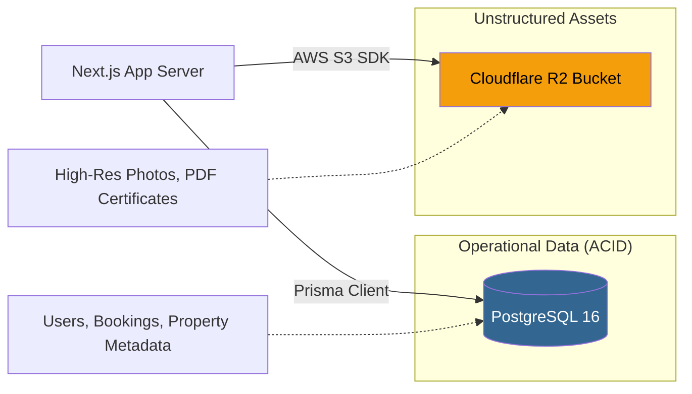

# 37. DATABASE ARCHITECTURE
**HomeLink 2.0 Enterprise Documentation**

## 1. Title
HomeLink 2.0 Database Architecture Strategy

## 2. Purpose
To define the global persistence strategy, separating structured operational data from unstructured static assets. This ensures high availability, speed, and cost efficiency.

## 3. Scope
Covers PostgreSQL (Relational Data), Cloudflare R2 (Object Storage), and Prisma ORM configurations.

## 4. Audience
- **Database Administrators & DevOps:** For provisioning and scaling database instances.
- **Backend Engineers:** For writing optimized queries.

## 5. Dependencies
- Supports the entities defined in `31_MODULE_BREAKDOWN.md`.

## 6. Definitions
- **ACID:** Atomicity, Consistency, Isolation, Durability. Properties that guarantee database transactions are processed reliably.
- **Egress:** Outbound data transfer from a cloud provider.

## 7. Architecture

### 7.1. Persistence Topology

## 8. Requirements

### 8.1. Relational Database (PostgreSQL 16)
- **Engine:** PostgreSQL 16 (Native/Dockerized di VPS).
- **ORM:** Prisma Client.
- **Tanggung Jawab:** Menyimpan seluruh data tabular, transaksi *booking*, riwayat verifikasi, profil *user*, dan relasi antar entitas.
- **Keamanan:** Kredensial *database* HARUS menggunakan variabel lingkungan (`.env`) yang sangat kuat (misal: panjang kata sandi minimum 32 karakter alfanumerik acak) karena *database* berada di VPS yang sama dengan aplikasi.

### 8.2. Object Storage (Cloudflare R2)
- **Alasan Pemilihan:** Cloudflare R2 menawarkan biaya *egress* $0 (bebas biaya *bandwidth* keluar), yang sangat krusial untuk platform properti yang didominasi oleh gambar resolusi tinggi, menghemat Opex hingga $90\%$ dibandingkan AWS S3 standar.
- **SDK:** Berinteraksi menggunakan `@aws-sdk/client-s3` (karena R2 S3-compatible).
- **Strategi Upload:** Aplikasi Node.js TIDAK BOLEH menerima *upload file* secara langsung melalui *body request*. Backend hanya men-*generate* **Pre-signed URL**, lalu *client* (*browser*) mengunggah file langsung ke *bucket* R2 untuk menghemat CPU dan RAM di VPS.

### 8.3. Prisma Migrations
- Skema database diatur sepenuhnya oleh file `prisma/schema.prisma`.
- Perubahan skema tidak boleh dilakukan langsung via *raw SQL* di server *production*. Semua perubahan harus melewati perintah `npx prisma migrate deploy` di dalam *pipeline* CI/CD.

## 9. Implementation
- DevOps must ensure daily automated backups of the PostgreSQL volume to a secure off-site location.

## 10. Acceptance Criteria
- [x] Clear architectural separation between structured data and heavy static assets.
- [x] R2 Upload strategy explicitly requires Pre-signed URLs.

## 11. Future Improvements
- Implement PgBouncer if the Next.js connection pool exceeds database limits in Phase 3.

## 12. References
- *Cloudflare R2 S3 API Compatibility Docs*

## 13. Version History
| Version | Date       | Author               | Status   | Notes                 |
| :---    | :---       | :---                 | :---     | :---                  |
| 1.0.0   | 2026-07-24 | Documentation Arch AI| APPROVED | Initial SSOT creation |
