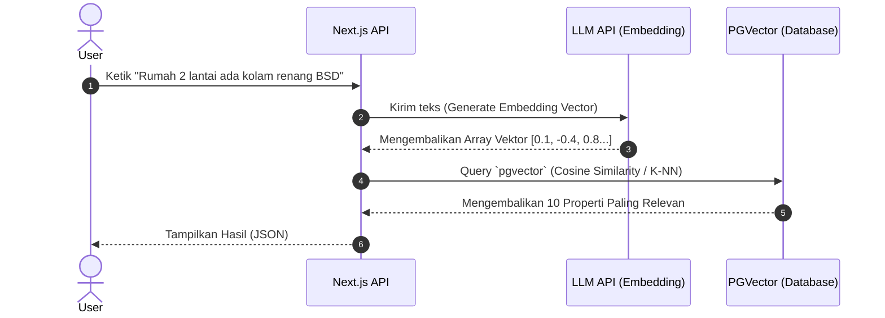

# 39. AI ARCHITECTURE
**HomeLink 2.0 Enterprise Documentation**

## 1. Title
HomeLink 2.0 Semantic AI & RAG Architecture

## 2. Purpose
To define the infrastructure for the platform's core differentiator: The Natural Language Property Search Engine. This document outlines how text is vectorized and queried using LLMs and Vector Databases.

## 3. Scope
Covers LLM integration (Gemini/OpenAI), Vector Embeddings, and the RAG (Retrieval-Augmented Generation) pipeline.

## 4. Audience
- **AI Engineers & Backend Engineers:** For implementing the search algorithms and embedding pipelines.

## 5. Dependencies
- This defines the inner workings of the Search feature listed in `03_PRODUCT_REQUIREMENT_DOCUMENT_PRD.md`.

## 6. Definitions
- **Vector Embedding:** The process of converting text (words/sentences) into arrays of numbers that capture semantic meaning.
- **RAG:** Retrieval-Augmented Generation. Supplying an LLM with relevant context retrieved from a database before generating an answer.

## 7. Architecture
PostgreSQL with `pgvector` extension serving as the Vector Store, interfacing with OpenAI/Gemini Embeddings API.

## 8. Requirements

### 8.1. AI Semantic Search Flow

### 8.2. Embedding Pipeline (Data Ingestion)
- Ketika *Owner* membuat *listing* baru dan disetujui Admin, sistem (melalui skema *Event Driven*) akan menggabungkan *field* Deskripsi, Fasilitas, Lokasi, dan Harga menjadi satu paragraf teks panjang ("Data Korpus").
- Paragraf ini dikirim ke Embedding API (misal: `text-embedding-3-small` atau Gemini).
- Hasil vektor disimpan pada kolom khusus bertipe `vector` (via ekstensi `pgvector`) pada baris properti yang bersangkutan di PostgreSQL.

### 8.3. Technology Choice
- **Vector Database:** Menggunakan PostgreSQL native dengan ekstensi `pgvector`. 
  - *Alasan:* Menghindari Opex tambahan dan kompleksitas jaringan dari layanan database vektor eksternal (seperti Pinecone/Milvus) di fase awal.
- **Model Embedding:** Standar industri dengan biaya rendah namun akurasi tinggi.

## 9. Implementation
- The database provisioning script MUST include the command `CREATE EXTENSION IF NOT EXISTS vector;` before Prisma migrations run.

## 10. Acceptance Criteria
- [x] Clear pipeline for both indexing data and querying data is established.
- [x] The architecture leverages existing infrastructure (PGVector) to save costs.

## 11. Future Improvements
- Implement a chat-based interface (RAG Bot) where users can converse back-and-forth about property recommendations.

## 12. References
- *pgvector Documentation*

## 13. Version History
| Version | Date       | Author               | Status   | Notes                 |
| :---    | :---       | :---                 | :---     | :---                  |
| 1.0.0   | 2026-07-24 | Documentation Arch AI| APPROVED | Initial SSOT creation |
